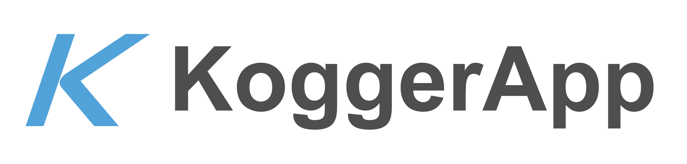
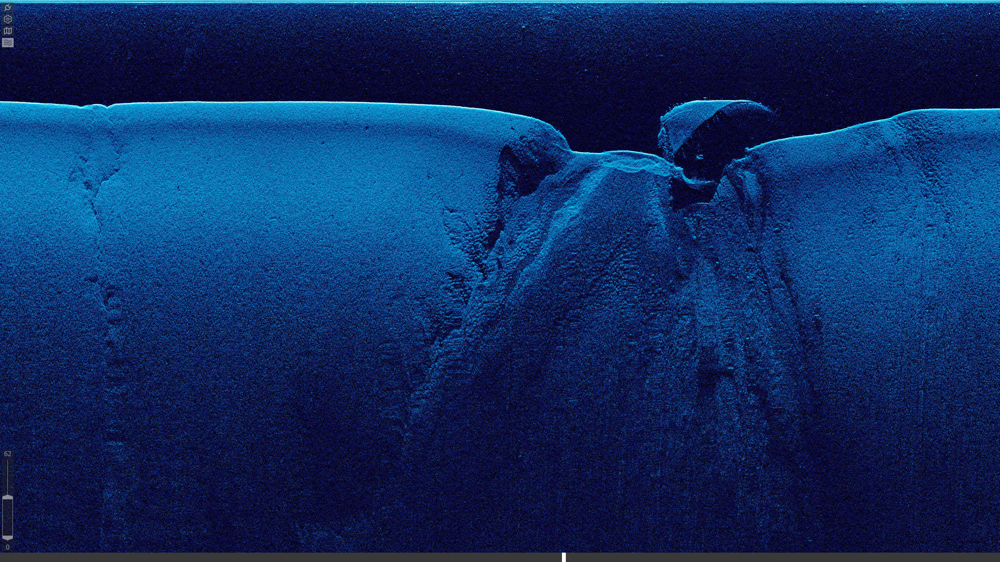
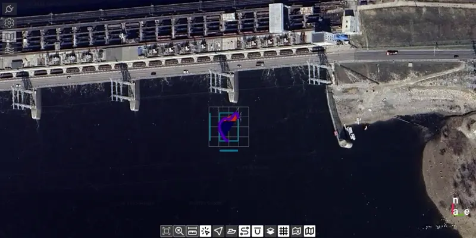
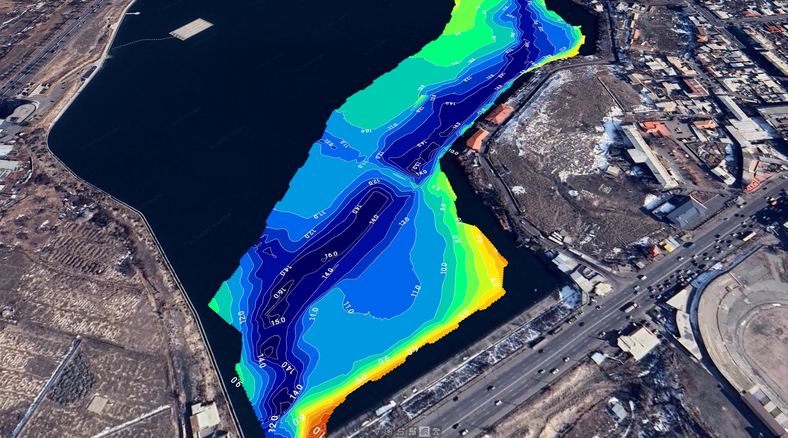
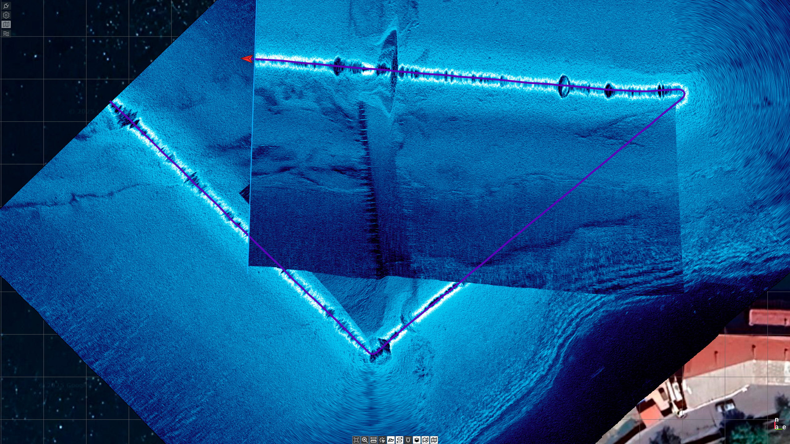
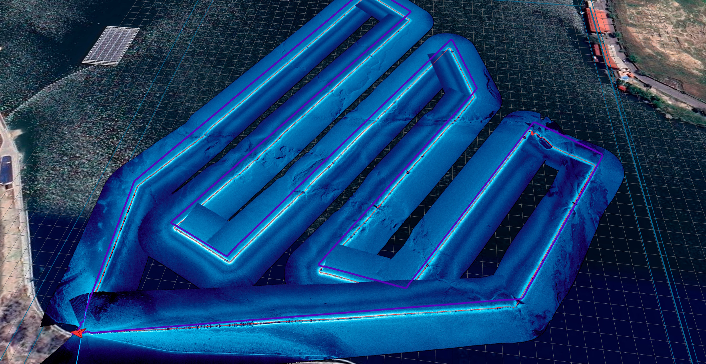
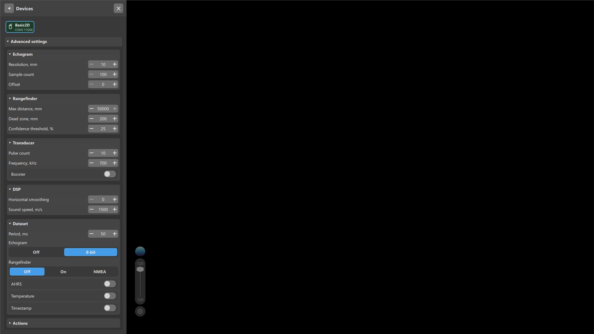
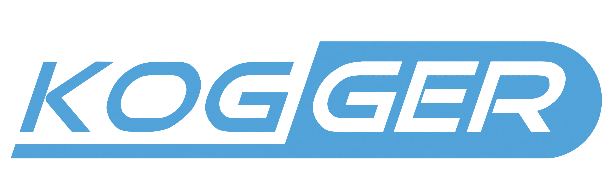

<p align="center">
  <a href="https://kogger.tech/koggerapp/">
    
  </a>
</p>

<p align="center">
    <a href="https://github.com/koggertech/KoggerApp/releases" style="text-decoration:none;">
      
    </a>
</p>

*KoggerApp* is a full-featured, easy-to-use, and free open-source software (FOSS) solution designed for hydrographic and survey applications. Whether you're a beginner or an experienced professional, KoggerApp delivers highly detailed visualization of sonar data collected from Kogger devices. The application is cross-platform and available for Windows, Android, and Linux.

---

### 🚤 *Key Features*
- Multiple connections of Kogger sonars via serial port or TCP/UDP network.

- Info panel with sonar, navigation and autopilot telemetry (depth, position, battery level, speed, communication quality).

- Real-time display of highly detailed echogram.
<p align="center">


</p>

- Depth calculation from received sonar data.

- Manual editing of measurement data (depth, bottom surface, etc.).

- Real-time isobaths calculation.
<p align="center">


</p>

- Real-time calculation of side scan mosaics.
<p align="center">



</p>

- Loading and displaying a globe map for georeferencing measurements to the survey location.

- Convert bottom track, bottom surface to .csv file for importing measurements into other applications.

- Customization of sonar acquisition parameters (frequency, sound speed, resolution, etc.).
<p align="center">

</p>

- Switching modes of operation for new users and professional researchers.

---

### 🛠️ *Installation*
You can download the latest release from the [Releases page](https://github.com/koggertech/KoggerApp/releases).

🪟 Windows (x86_64):  
Supported versions: Windows 10 (1809 or later), 11.  
- Portable: Download .zip. Extract and run "KoggerApp.exe".  
- Installer: Download and launch the installer (Optionally associates .klf files with the app during setup).

🤖 Android (universal APK: armeabi-v7a + arm64-v8a):  
Supported versions: Android 9.0 (Pie, level 28) and above.  
A single **universal .apk** carries both ABIs, so there is no per-device variant to choose — download that one file and install it. You may need to enable "Install from unknown sources" in your device settings.

🐧 Linux (x86_64, AppImage):  
The AppImage bundles Qt and the application's own libraries — it runs on any modern x86_64 distribution with **glibc 2.39 or newer**. The AppImage is built on Ubuntu 24.04, and glibc is never bundled into an AppImage; check yours with `ldd --version`.

Runs on: Ubuntu 24.04+, Linux Mint 22+, Pop!_OS 24.04+, elementary OS 8+, Debian 13+, Fedora 40+, RHEL / Rocky / AlmaLinux 10+, Arch / Manjaro / EndeavourOS and openSUSE Tumbleweed.

Download the .AppImage file and make it executable:
```bash
chmod +x KoggerApp_version_linux_x86_64.AppImage
```
and run:
```bash
./KoggerApp_version_linux_x86_64.AppImage
```

---

### 🧱 *Build Instructions*
*KoggerApp* is a cross-platform C++ Qt QML project, built with **CMake** (CMake ≥ 3.22, Qt 6.8.3, C++23). You can build it on Windows, Linux, and Android using the appropriate Qt kits and compilers. The easiest way is to open the top-level `CMakeLists.txt` in Qt Creator, select a kit, and build; a command-line example is given for Linux below.

🪟 Windows (x86_64):  
Compiler: LLVM-MinGW 17.0.6  
Qt version: Qt 6.8.3 (llvm-mingw_64)  
Steps:
- Open `CMakeLists.txt` in Qt Creator (File > Open File or Project)
- Select the LLVM-MinGW 64-bit kit
- Build > Build Project (Qt Creator runs CMake configure automatically)
- Run from Qt Creator or find `KoggerApp.exe` under `build/`

🤖 Android (armeabi-v7a, arm64-v8a)  
Compiler: Clang from NDK 27.3.13750724  
Qt version: Qt 6.8.3 (android_arm64_v8a)  
Set up the Android SDK/NDK in Qt Creator (Tools > Options > Devices > Android)  
Steps:
- Open `CMakeLists.txt` in Qt Creator
- Select the Android (arm64-v8a) kit — a single kit produces a **universal APK** with both ABIs; keep the `android_armeabi_v7a` Qt installation present for the second-ABI sub-build
- Build > Build Project
- Install the generated `.apk` on a device

🐧 Linux (x86_64)  
Compiler: Clang 18.1.3  
Qt version: Qt 6.8.3 (gcc_64)  

Build dependencies besides Qt itself:
- Debian / Ubuntu: `sudo apt install build-essential cmake ninja-build libgl1-mesa-dev`
- Fedora / RHEL: `sudo dnf install gcc-c++ cmake ninja-build mesa-libGL-devel`
- Arch / Manjaro: `sudo pacman -S base-devel cmake ninja mesa`
- openSUSE: `sudo zypper install gcc-c++ cmake ninja Mesa-libGL-devel`

Clone and build (set `CMAKE_PREFIX_PATH` to your Qt installation):
```bash
git clone https://github.com/koggertech/KoggerApp.git
cd KoggerApp
cmake -S . -B build -G Ninja \
      -DCMAKE_BUILD_TYPE=Release \
      -DCMAKE_PREFIX_PATH="$HOME/Qt/6.8.3/gcc_64"
cmake --build build -j"$(nproc)"
./build/KoggerApp
```

---

### 💻 *Get Involved!*
KoggerApp is open-source, meaning you have the power to shape it! Whether you're fixing bugs, adding features, or customizing for your specific needs, KoggerApp welcomes contributions from the community.

---

### 📜 *License*
KoggerApp is released under the **GNU General Public License v3** — full text in [LICENSE](LICENSE).

Third-party components: [Qt](https://www.qt.io/) 6.8.3 (GNU LGPL v3), [FFmpeg](https://ffmpeg.org/) 7.1 (GNU LGPL v2.1 or later), [FreeType](https://freetype.org/) 2.13.2 (FreeType License). Provenance and sources: [THIRD_PARTY_NOTICES.md](THIRD_PARTY_NOTICES.md). All license texts also ship in the app — *Settings → Interface → About*.

---

### 🔗 *Useful links*
- 🌐 [Official Website](https://kogger.tech/)
- 📄 [KoggerApp Product Page](https://kogger.tech/koggerapp/)

---

Unlock next-level insights in hydrography and survey with KoggerApp.

<p align="center">
<a href="https://kogger.tech/">
  
</a>
</p>
