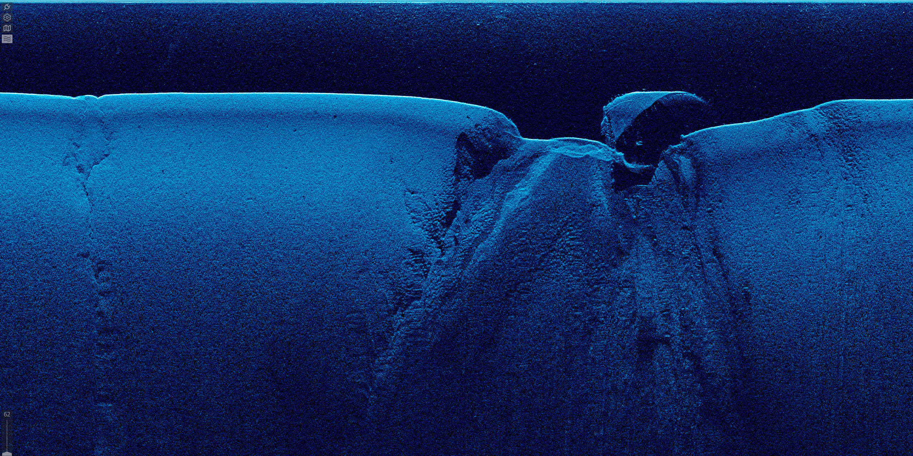
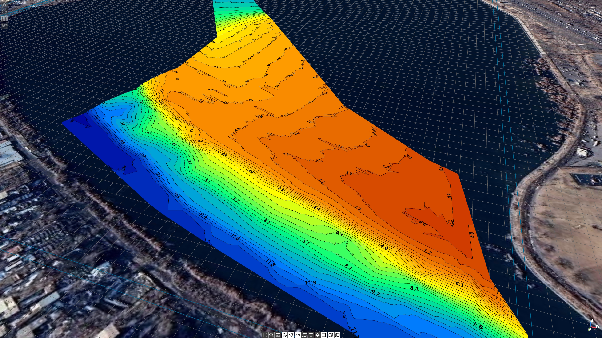
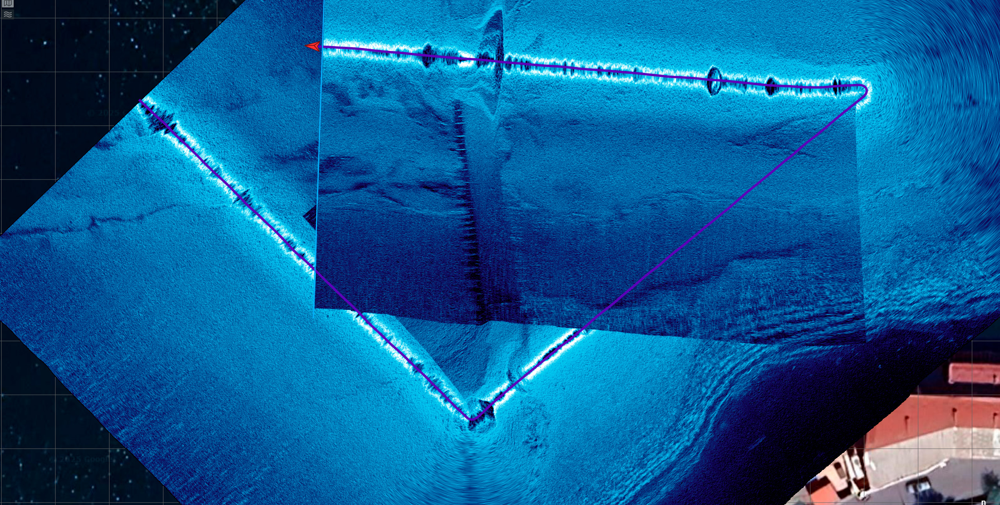
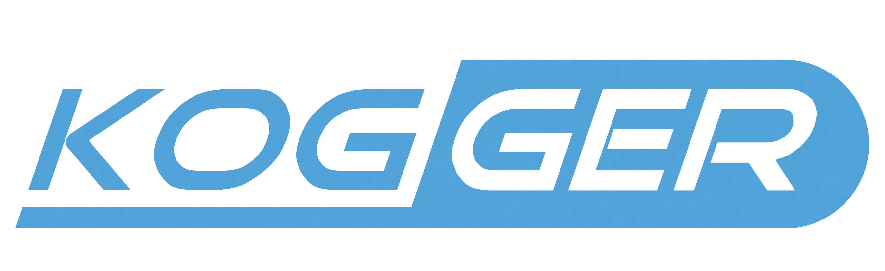

<p align="center">
  
</p>

<p align="center">
    <a href="https://github.com/koggertech/KoggerApp/releases" style="text-decoration:none;">
      
    </a>
</p>

*KoggerApp* is a full-featured, easy-to-use, and free open-source software (FOSS) solution designed for hydrographic and survey applications. Whether you're a beginner or an experienced professional, KoggerApp delivers highly detailed visualization of sonar data collected from Kogger devices. The application is cross-platform and available for Windows, Android, and Linux.

---

### 🚤 *Key Features*
- Multiple connections of Kogger sonars via serial port or TCP/UDP network.

- Autopilot data display (battery level, speed, communication quality).

- Real-time display of highly detailed echogram.
<p align="center">


</p>

- Depth calculation from received sonar data.

- Manual editing of measurement data (depth, bottom surface, etc.).

- Real-time isobaths calculation.
<p align="center">


</p>

- Real-time calculation of side scan mosaics.
<p align="center">



</p>

- Loading and displaying a globe map for georeferencing measurements to the survey location.

- Convert bottom track, bottom surface to .csv file for importing measurements into other applications.

- Customization of sonar acquisition parameters (frequency, sound speed, resolution, etc.).
<p align="center">

</p>

- Switching modes of operation for new users and professional researchers.

---

### 🛠️ *Installation*
You can download the latest release from the [Releases page](https://github.com/koggertech/KoggerApp/releases).

🪟 Windows (x86_64):  
Supported versions: Windows 10 (1809 or later), 11.  
- Portable: Download .zip. Extract and run "KoggerApp.exe".  
- Installer: Download and launch the installer (Optionally associates .klf files with the app during setup).

🤖 Android (armeabi-v7a, arm64-v8a):  
Supported versions: Android 9.0 (Pie, level 28) and above.  
Download and install the .apk file. You may need to enable "Install from unknown sources" in your device settings.

🐧 Linux (Ubuntu x86_64):  
Supported distributions: Ubuntu 22.04, 24.04 and compatible systems.  
Download the .AppImage file and make it executable:
```bash
chmod +x KoggerApp_version_linux_x86_64.AppImage
```
and run:
```bash
./KoggerApp_version_linux_x86_64.AppImage
```

---

### 🧱 *Build Instructions*
*KoggerApp* is a cross-platform C++ Qt QML project, built using a .pro file. You can build it on Windows, Linux, and Android using the appropriate Qt kits and compilers.

🪟 Windows (x86_64):  
Compiler: LLVM-MinGW 17.0.6  
Qt version: Qt 6.8.3 (llvm-mingw_64)  
Steps:
- Open the .pro file in Qt Creator
- Select the LLVM-MinGW 64-bit kit
- Click Build > Run qmake, then Build > Build Project
- Run the application from Qt Creator or find the built binary in build/

🤖 Android (armeabi-v7a, arm64-v8a)  
Compiler: Clang from NDK 27.3.13750724  
Qt version: Qt 6.8.3 (android_armv7 or android_arm64_v8a)  
Set up Android SDK/NDK in Qt Creator (via Tools > Options > Devices > Android)  
Steps:
- Open the .pro file in Qt Creator
- Select Android kit
- Click Build > Run qmake, then Build > Build Project
- Use the .apk file generated in android-build/ to install on a device

🐧 Linux (Ubuntu x86_64)  
Compiler: Clang 18.1.3  
Qt version: Qt 6.8.3 (gcc)  
Clone and build:
```bash
git clone https://github.com/koggertech/KoggerApp.git
cd KoggerApp
qmake
make -j$(nproc)
./KoggerApp
```

---

### 💻 *Get Involved!*
KoggerApp is open-source, meaning you have the power to shape it! Whether you're fixing bugs, adding features, or customizing for your specific needs, KoggerApp welcomes contributions from the community.

---

### 🔗 *Useful links*
- 🌐 [Official Website](https://kogger.tech/)

---

Unlock next-level insights in hydrography and survey with KoggerApp.

<p align="center">

</p>
